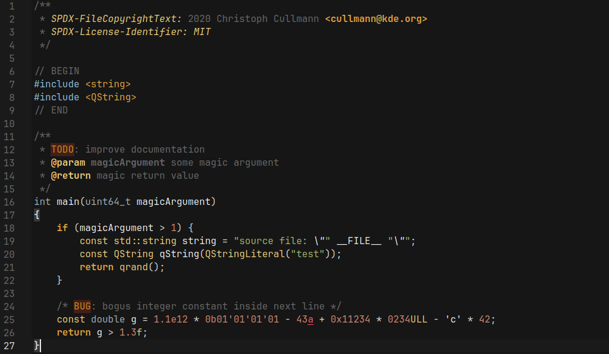

# Underground theme for the KSyntaxHighlighting engine
KSyntaxHighlighting port of Underground, *the dark theme carefully crafted from scratch, which utilizes calm colors on a neutral dark background*.

Original theme for Zed Editor can be found [here](https://github.com/i-amdroid/zed-underground-theme).

## Screenshot

## Installation
See the [KDE documentation](https://docs.kde.org/stable5/en/kate/katepart/color-themes.html).
